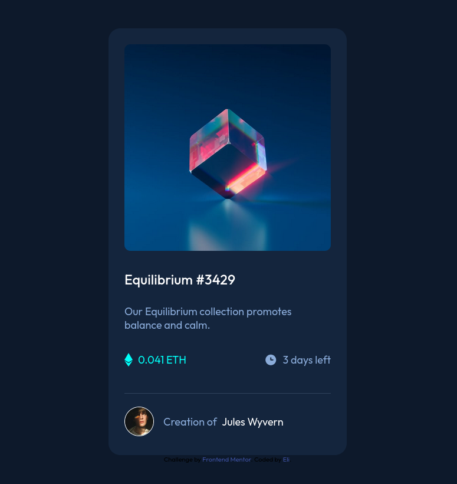

# Frontend Mentor - NFT preview card component solution

This is a solution to the [NFT preview card component challenge on Frontend Mentor](https://www.frontendmentor.io/challenges/nft-preview-card-component-SbdUL_w0U). 
Frontend Mentor challenges help you improve your coding skills by building realistic projects. 

## Table of contents

- [Frontend Mentor - NFT preview card component solution](#frontend-mentor---nft-preview-card-component-solution)
  - [Table of contents](#table-of-contents)
  - [Overview](#overview)
    - [The challenge](#the-challenge)
    - [Screenshot](#screenshot)
    - [Links](#links)
  - [My process](#my-process)
    - [Built with](#built-with)
    - [What I learned](#what-i-learned)
      - [1. Applying an image overlay w/ hover effect](#1-applying-an-image-overlay-w-hover-effect)
      - [2. Can't change opacity of decendant elements to a different value than parent](#2-cant-change-opacity-of-decendant-elements-to-a-different-value-than-parent)
    - [Continued development](#continued-development)
      - [Useful resources](#useful-resources)
  - [Author](#author)

## Overview

### The challenge

Users should be able to:

- View the optimal layout depending on their device's screen size
- See hover states for interactive elements

### Screenshot

### Links

- Solution URL: [Github Repo](https://github.com/elixy/nft-card-component)
- Live Site URL: [Github Pages](https://elixy.github.io/nft-card-component/)

## My process

Went about it in 4-5 phases:
- general layout
- Applying colors , missing elements like icons, and fine tuning layout
- Responsive to mobile
- Adding hover effects to main image, title and author's name

### Built with

- Semantic HTML5 markup
- CSS custom properties
- Flexbox

### What I learned

#### 1. Applying an image overlay w/ hover effect

First time implementing this, had to look at several examples and play around with the css to understand more about how it works. Still somewhat confusing, but will learn more as I re-implement it in future projects. 

#### 2. Can't change opacity of decendant elements to a different value than parent

I discovered applying transperancy will not allow you to change it for decendant elements. 
My icon-view.svg before the fix also had 50% opacity. I had to convert it to a sibling and apply similar
rules for layout but opacity to 100%. 

### Continued development

Initially I tried to apply the image overlay using flexbox only, will need to research more about how that works. 

#### Useful resources

- [How TO - Image Overlay Icon](https://www.w3schools.com/howto/howto_css_image_overlay_icon.asp) - This helped me apply overlay effects on images. I really liked this pattern but will seek out different implementations. 
  
- [Non-Transparent Elements Inside Transparent Elements](https://css-tricks.com/non-transparent-elements-inside-transparent-elements/) - This is an amazing article understand how differing opacities can't exist in if one element is a decendant of the other. I'd recommend it to anyone still learning this concept.

## Author

- Frontend Mentor - [@elixy](https://www.frontendmentor.io/profile/elixy)
- Twitter - [@elixy_dev](https://www.twitter.com/elixy_dev)

